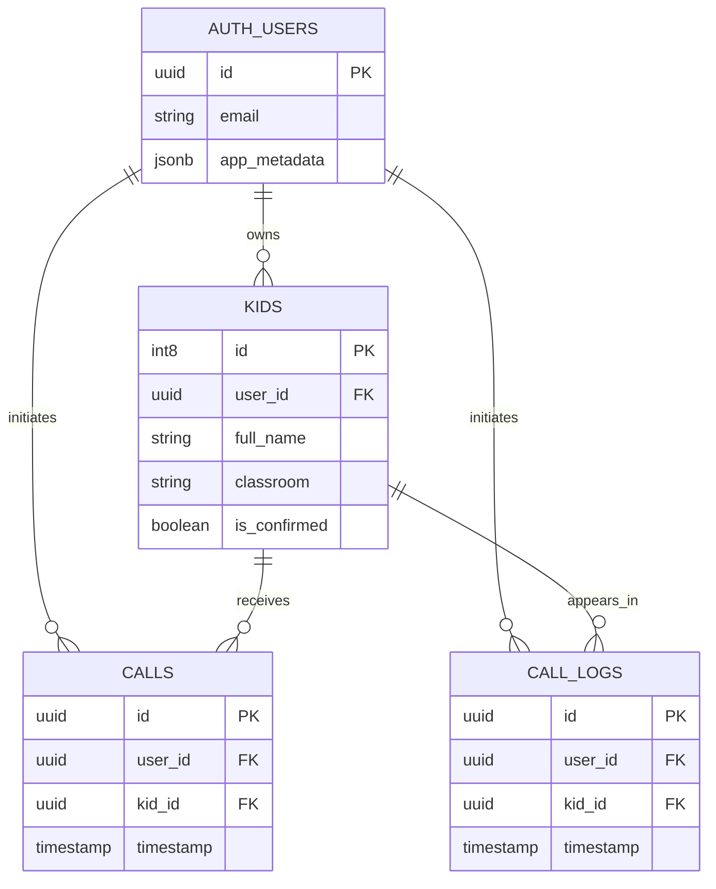

# Kid Call

Kid Call is a small backend service for managing children associated with authenticated users and, in future iterations, recording calls made for those children.

The project currently provides a protected REST API for creating and retrieving kid records. Authentication is delegated to [Supabase Auth](https://supabase.com/docs/guides/auth), while application data is stored in Supabase Postgres.

## Project status

This repository is an early backend implementation.

### Implemented

- Verify Supabase access tokens on every API request.
- Add a kid for the authenticated user.
- Retrieve kids associated with a specified user ID.
- Automatically confirm kids created by an admin.
- Create an initial admin account with a seed script.
- Validate incoming kid data with Joi.

### Planned

- Initiate calls for a kid.
- Store active or requested calls in `public.calls`.
- Store call history in `public.call_logs`.
- Expose admin endpoints for listing and confirming kids.
- Add automated tests and centralized error handling.

The code contains an empty `callKid` controller and an unrouted `getAllKids` controller as placeholders for some of this work.

## Domain model

An authenticated Supabase user can own multiple kids. Calls and call logs are expected to link both the user who initiated the action and the kid involved.



Only `public.kids` is used by the current API. `public.calls` and `public.call_logs` describe the intended calling workflow shown in the project design.

## Request flow

1. A client authenticates through Supabase Auth and receives an access token.
2. The client sends the token as `Authorization: Bearer <token>`.
3. `protectedRoute` finds the matching Supabase public key and verifies the ES256 JWT.
4. The middleware adds the user's `id`, `email`, and application `role` to `req.user`.
5. The kids router validates the request and runs the corresponding controller.
6. The controller accesses Supabase using the server-side service key.

All routes are protected because the authentication middleware is registered before the API router in `app.js`.

## Project structure

```text
.
|-- app.js                         # Express application and route registration
|-- kids/
|   |-- kids.js                    # Kid controllers and Supabase queries
|   |-- urls.js                    # /api/kids route definitions
|   `-- validators.js              # Joi request validation
|-- middlewares/
|   `-- protected-route.js         # Bearer-token authentication middleware
|-- seeds/
|   `-- seed-admin.js              # Creates the initial Supabase admin user
|-- utils/
|   |-- create-supabase-client.js  # Shared privileged Supabase client
|   `-- token-verification.js      # JWT and JWKS verification
|-- package.json
`-- README.md
```

The project uses native ECMAScript modules (`"type": "module"`).

## Getting started

### Prerequisites

- Node.js 18 or newer
- npm
- A Supabase project
- A `public.kids` table matching the domain model above

### Installation

```bash
npm install
```

Create a `.env` file in the repository root:

```dotenv
LISTEN_PORT=3000
SUPABASE_URL=https://your-project-id.supabase.co
SUPABASE_PROJECT_ID=your-project-id
SUPABASE_SERVICE_KEY=your-service-role-key
```

`DB_SECRET` exists in the current local configuration but is not read by the application.

The service-role key bypasses normal Supabase access controls. Keep it server-side, never expose it to a browser or mobile client, and do not commit `.env`.

### Create the admin user

```bash
npm run seed-admin
```

The script creates `admin@example.com` with `app_metadata.role` set to `admin`. It prints a generated password once; store it securely. Running the command again skips creation when that email already exists.

### Start the API

```bash
npm start
```

The development server runs with Nodemon and listens on `LISTEN_PORT`.

## API

Base path: `/api/kids`

Every request requires this header:

```http
Authorization: Bearer <supabase-access-token>
```

### Add a kid

```http
POST /api/kids
Content-Type: application/json
Authorization: Bearer <supabase-access-token>

{
  "full_name": "Maya Ahmed",
  "classroom": "2A"
}
```

Validation rules:

- `full_name` is required and must contain at least 2 characters.
- `classroom` is required and must contain 2 to 3 characters.

The authenticated user's ID is used as `user_id`. A kid created by an admin is immediately stored with `is_confirmed: true`; other users create unconfirmed records. A successful request returns `200 OK`.

The controller also supports an optional `user_id` in the body for admin-oriented use, but the current validator does not accept or validate it as part of the public API contract.

### Get kids for a user

```http
GET /api/kids/:id
Authorization: Bearer <supabase-access-token>
```

Example:

```bash
curl \
  -H "Authorization: Bearer $ACCESS_TOKEN" \
  http://localhost:3000/api/kids/USER_ID
```

The response is a JSON array containing all rows in `public.kids` whose `user_id` matches `:id`.

> Note: the current controller does not restrict `:id` to the authenticated user's ID or to admins. Add an ownership/role check before treating this endpoint as production-ready.

## Authentication and roles

Tokens are verified against the project's Supabase JWKS endpoint:

```text
https://<SUPABASE_PROJECT_ID>.supabase.co/auth/v1/.well-known/jwks.json
```

The verifier expects ES256 tokens and reads the application role from `app_metadata.role`. The seed script assigns the `admin` role to the initial admin account. Regular authenticated users may have no explicit role.

## Development notes

- There is no public health-check route; the global authentication middleware protects every request.
- Database migrations are not currently included, so the Supabase schema must be created separately.
- The API currently returns raw Supabase errors for database failures.
- No test or lint command is configured yet.

These limitations are useful starting points for the next development phase, especially before exposing the service outside a controlled environment.
